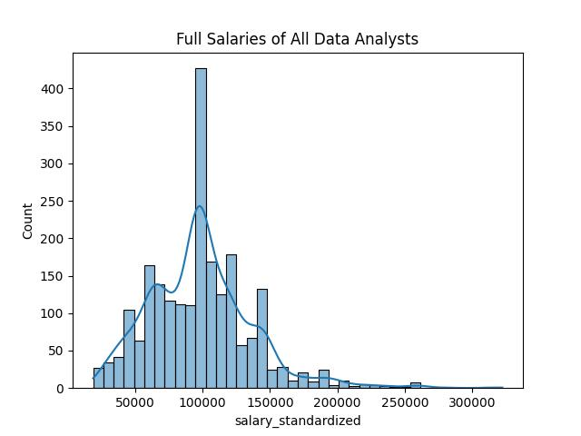
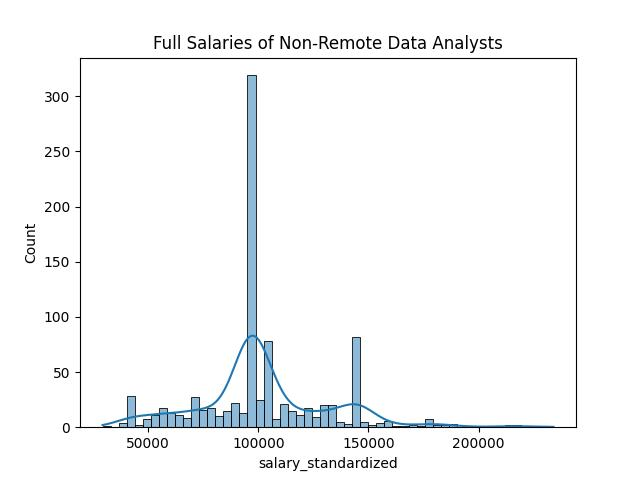
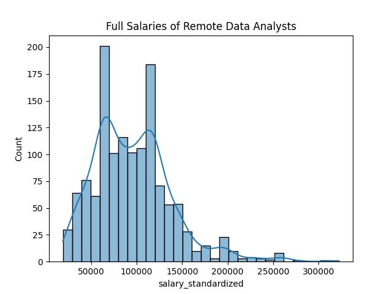
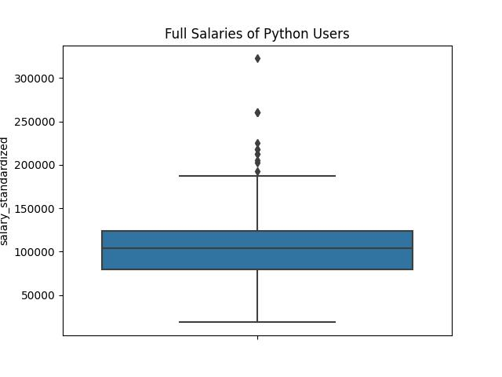
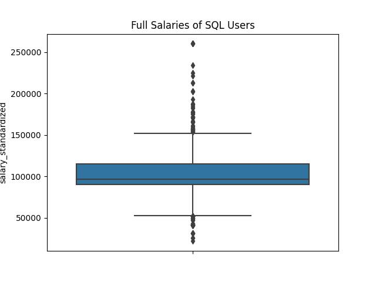
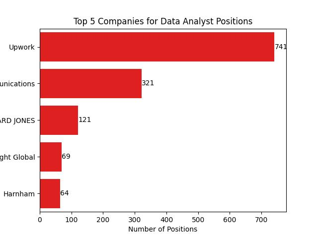
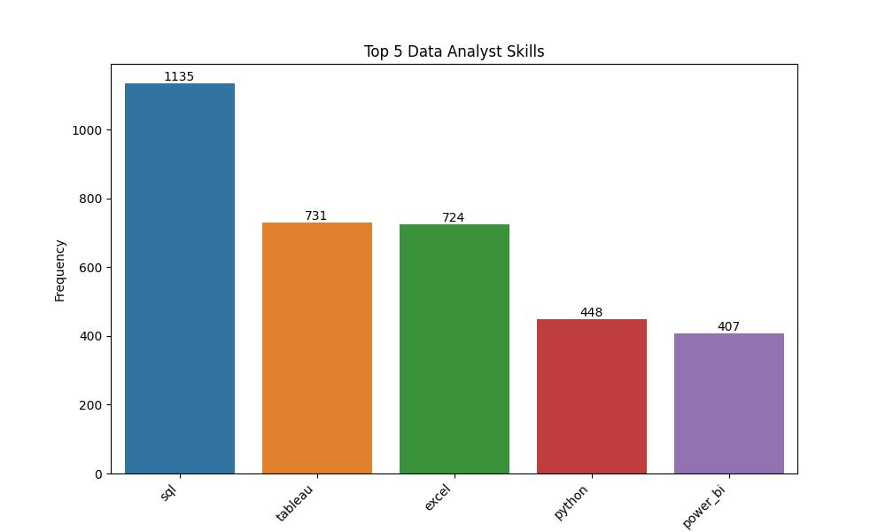
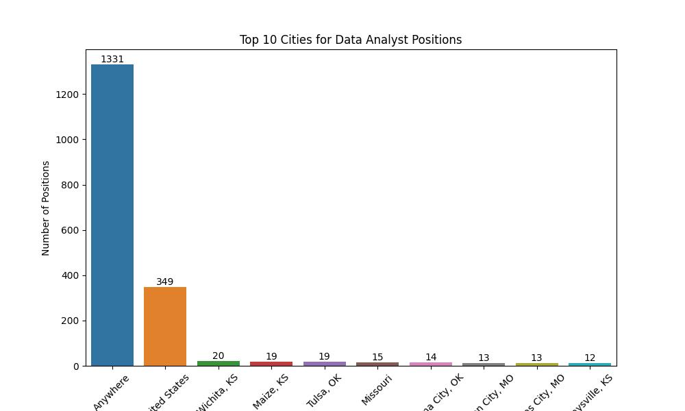

# Job-Statistics

This project is a python ETL pipeline that analyzes the outlook of data analyst jobs late 2022 - early 2023

# Data Analyst Job Postings Analysis

In this project, I analyzed a dataset containing job postings for data analysts that identifies trends and statistics related to salary, location, and required skills. This particular dataset contains information of over 2,000 job postings which includes job title, company name, location, salary, required skills, and more.

# Packages Used

Pandas / Import csv / SQL-alchemy / Scipy / Scipy.stats / Seaborn & Matplotlib.pyplot for visualizations / SkLearn 

# Methodology by File

First, in **extract.py**, I utilized `sql-alchemy` to extract data kept in the database for this analysis. Mapped classes are created with default matching of the table names and I built queries to pull all Amazon data and created and saved new variables into dataframes in which I made two merges of these new dataframes into a new file for analysis.

Second, in **transform.ipynb**, I fill in all missing values in the `work_from_home` column to be `False`.

* I created a new column for each possible skill specified in the `description_tokens` column. This is called getting dummy variables or "one-hot-encoding".
    * I saved this dataframe with newly engineered features back into the `data/` folder for later use in `eda.ipynb`.
* I created a new dataframe that drops all rows that contain `null` values in the `salary_standardized` column from the newly engineered dataframe above.
    * I saved this dataframe to my `data/` folder for later use in `predict.ipynb` file.

Third, in **eda.py**, I analyzed the distributions and Kolmogorov-Smirnov normality test for all data analysts, remote, non-remote data analysts, and the required skills to become a data analyst using histograms and boxplots. In this file, I also visualized the top 10 companies and locations in the U.S. for data analysts to work at (anywhere is remote by the way). 

* The frequency of skill occurrence in the dataset was calculated and visualized using a bar chart. The top 5 desired skills of data analysts are SQL, Python, Excel, Tableau, and Power_Bi. 

    * The frequency of city occurrence in the dataset was calculated and visualized using a bar chart and the Top 10 Cities for Data Analyst Positions are Anywhere (Remote), Wichita, Maize, and Tulsa.

    * The frequency of company occurrence in the dataset was calculated and visualized using a bar chart and the Top 10 Companies for Data Analyst Positions are UpWork, Cox Communications, Edward Jones, and Insight Global.

Finally, in **predict.ipynb**, 

* I created a linear regression model with `standard_salaries` as your dependent variable, and all listed `description_token_` columns , `schedule`, & `work_from_home` as the independent variables.
* Print out it's accuracy  which is the R2 value. R2 value is 11% (0.11204955609991529). This R2 value is low so it wouldn't be reliable to use. 
* Print out it's coefficients `lin.coef_`. For example, knowing how to use airflow (coef value, 7013.1332895065) can add $7,013 to a data analyst's yearly salary whereas alteryx (coef value -782.5448134001) can reduce the salary by $782.

# Visuals

This analysis used various visualizations to represent the data and its findings. A histogram was used to visualize the distribution of salary_standardized, while boxplots were used to visualize the distribution of standard_salaries for positions that require specific skills. Bar charts, histograms, and other charts were used to represent the frequency of skill, city, and company occurrences.

 

# Next Actions

Doing ANOVA on these salaries for remote and non-remote workers to test their variance would prove feasible since the salary ranges are quite close. With ANOVA we could see if the salary is true across-the-board or if there might've been a mistake in the data collection. In the comapny section, the data was skewed toward freelance and contract-based data analyst work instead of corporate salary positions because of recruiting companies in this dataset. 